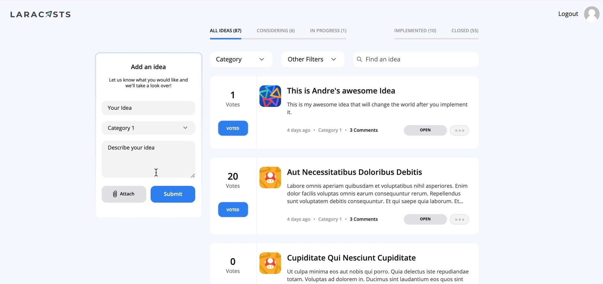

<h2>Build a Voting App</h2>
<small>Version: Laravel *, Tailwind *, Livewire *</small>

In this workshop, we’ll build a voting app, similar to UserVoice, that allows you to create ideas, vote and comment on them, sort and filter the results, and even administer the site. We’ll start from scratch and work through the entire process, including implementing the design, working on all of the features, testing our code, and more.

We’ll be making use of the TALL (Tailwind, Alpine, Livewire, Laravel) stack in this particular series.

<h3>App Idea</h3>

